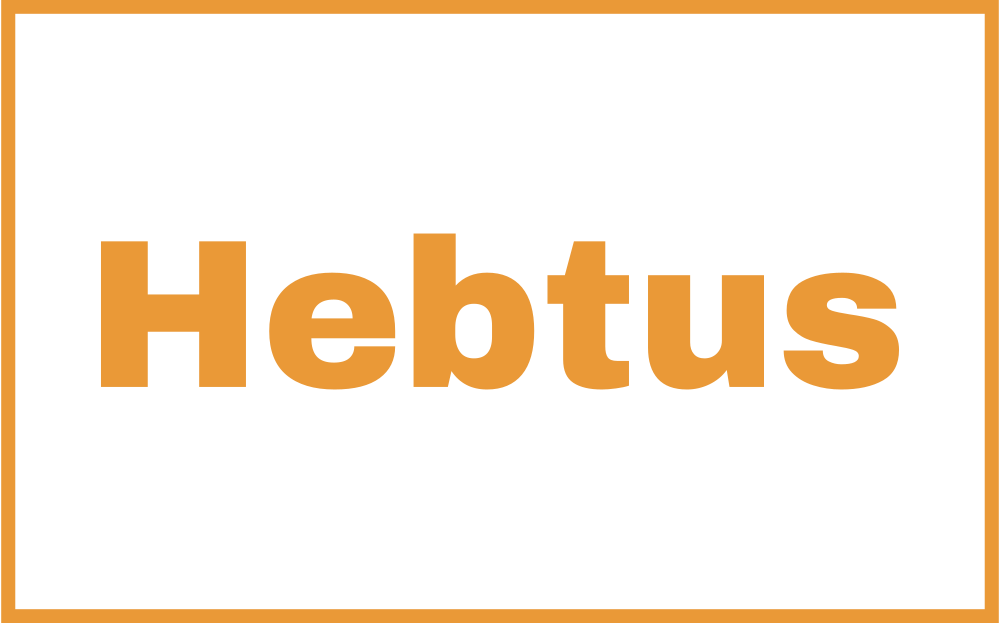

 

  

  <h3 align="center">Hebtus - Cross Platform Application</h3>

  

    An Eventbrite cross-platform clone
     
     
    <a href="https://github.com//"><strong>Explore the docs »</strong></a>
     
     
    <a href="https://github.com//">View Demo</a>
    .
  

## Table Of Contents

* [About the Project](#about-the-project)
* [Built With](#built-with)
* [Authors](#authors)

## About The Project

## Built With

  
  

###

## Authors

